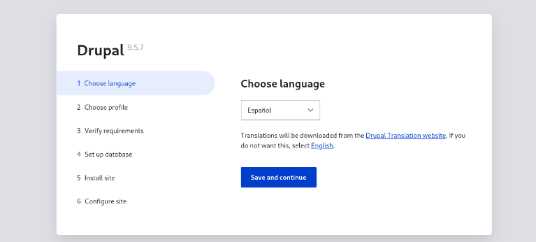
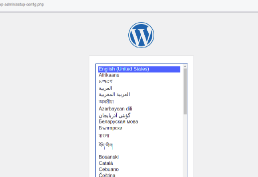

# Práctica 3 Docker

<br>

<div>
<p style = 'text-align:center;'>

</p>
<center>

**Autor: Jonathan Muñoz Morales**

</center>
</div>

<br>

En esta práctica debemos subir el fichero **docker-compose.yml** que hemos creado y además, la explicación de la configuración realizada en el fichero. Así como algunas capturas donde se requiera mostrar el navegador en correcto funcionamiento.

Esta práctica esta dividida en dos partes, por lo que comenazaremos con la primera.

## Parte 1
1. Crear un fichero **docker-compose.yml** con dos servicios: *drupal*+*mysql*.
2. Hacer que el servicio drupal utilice el puerto 81.
3. Hacer que ambos contenedores usen un volumen **volumenDocker** ya creado.
4. Comprobar que puede acceder a **localhost:81 y puede visualizar la página de configuración de drupal.

Creamos el archivo **docker-compose.yml**:

```yml
    version: '3.9'          
    services:
    db:                    
        image: mysql:5.7    //imagen usada para MySQL
        volumes:
        - volumenDocker:/var/lib/mysql
        environment:
        MYSQL_ROOT_PASSWORD: example
        MYSQL_DATABASE: drupal
        MYSQL_USER: drupal
        MYSQL_PASSWORD: drupal
    drupal:
        image: drupal:9-apache      
        ports:
        - "81:80"                   //puerto en el que se escucha
        volumes:
        - volumenDocker:/var/www/html
        environment:
        DRUPAL_DATABASE_HOST: db
        DRUPAL_DATABASE_NAME: drupal
        DRUPAL_DATABASE_USER: drupal
        DRUPAL_DATABASE_PASSWORD: drupal
    volumes:
    volumenDocker:
```

Donde ``` version: '3.9' ``` es la versión usada, ``` image: drupal:9-apache``` es la imagen usada para drupal y ```- "81:80``` es el puerto donde vamos a escuchar (81).

Ahora si intentamos acceder al puerto 81 de localhost:

<br>

<div>
<p style = 'text-align:center;'>

</p>
<center>

**Autor: Jonathan Muñoz Morales**

</center>
</div>

<br>


Con esto terminamos la primera parte de la práctica de docker. Ahora pasaremos a la siguiente parte donde usaremos wordpress y mariadb.

## Parte 2

En esta parte de la práctica debemos:

1. Crear un fichero **docker-compose.yml** con dos servicios: *wordpress*+*mariadb*.
2. Hacer que el servicio wordpress utilice el puerto 82.
3. Hacer que ambos contenedores usen la red **redDocker**.
4. Comprobar que puede acceder a **localhost:82** y ver la configuración.

Creamos el archivo **docker-compose.yml**:

```yml
    version: '3'                        
    services:                           
    db:                               
    image: mariadb:latest             
    environment:                      
    - MYSQL_DATABASE=wordpress       
    - MYSQL_ROOT_PASSWORD=mariadb    
    networks:                         
    - redDocker                      
    web:                               
    image: wordpress:latest           
    depends_on:                       
    - db                             
    ports:                            
    - "82:80"                        //puerto de escucha
    networks:                         
    - redDocker                      
    networks:                           
    redDocker:                         

```

Donde ```image: mariadb:latest``` es la imagen usada para **mariadb** y ```- "82:80"``` es el puerto donde vamos a estar escuchando(82).

<br>

<div>
<p style = 'text-align:center;'>

</p>
<center>

**Autor: Jonathan Muñoz Morales**

</center>
</div>

<br>

- 
- 